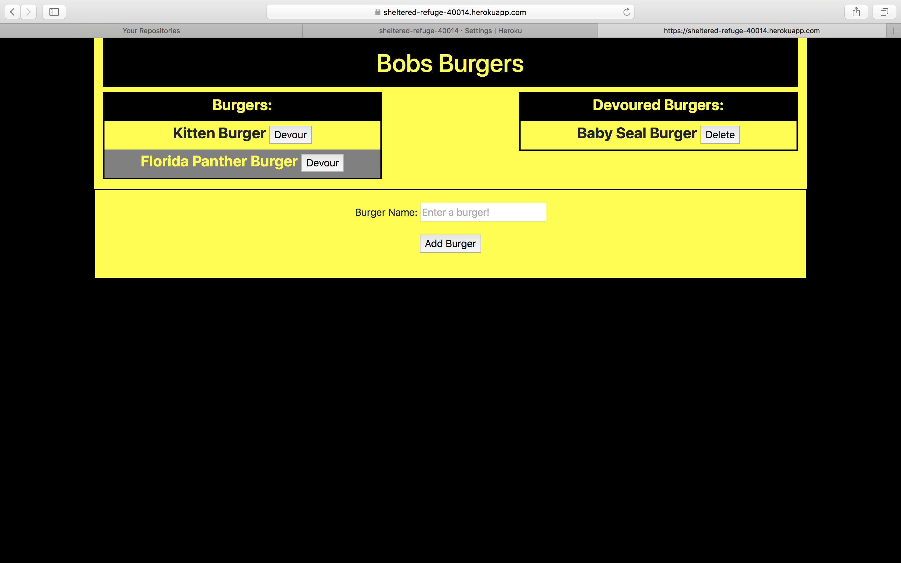

# Burger Tracking App #

An application to create, track, and delete burgers from a database to track inventory. Uses Node.js Server and MySQL Database

## Contributors ##

Angel Martinez

## Instructions ##

1. Clone repo.
2. Ensure Node is installed and a MySQL database is available.
3. Use the schema and seeds files provided in the db folder to set up and populate the database.
4. Modify connection.js in the config folder to connect to .
6. Using the command line navigate to the Burger root folder and execute the command "npm install".
6. Once npm installs the packages run the command "node server.js".
7. The command line will display the localhost address/port the server is listening on.
8. In a browser, navigate to the local host address displayed.
9. The application will allow the addition of new burgers, changing the status of a burger to "devoured" and deleting burgers.

